# Olá! Eu sou o Davi Eduardo 👋

### 🎓 Análise e Desenvolvimento de Sistemas | Background em Psicologia
### 🛠️ Analista de Suporte Técnico & Desenvolvedor em Formação

  
  
  

---

## 🚀 Sobre Mim

Sou um entusiasta da tecnologia que acredita que o código é uma ferramenta para resolver problemas humanos. Minha trajetória é marcada pela interseção entre **Ciências Exatas** e **Humanas**:

*   🔭 **Atualmente:** Atuo como **Analista de Suporte**, lidando com diagnóstico avançado, VoIP, Redes e infraestrutura, enquanto curso **Análise e Desenvolvimento de Sistemas**.
*   🧠 **Diferencial:** Minha formação prévia em **Psicologia** me proporciona uma visão única sobre *Experiência do Usuário (UX)*, *Soft Skills* e *Resolução de Conflitos*, aplicando a metodologia científica e o pensamento crítico no troubleshooting diário.
*   🌱 **Estudando:** Aprofundando conhecimentos em Desenvolvimento Web (HTML/CSS/JS), Python e Gestão de Redes.

---

## 🛠️ Arsenal Técnico

Minhas habilidades combinam o desenvolvimento de software com a vivência prática de infraestrutura e suporte.

### 💻 Tech Stack

  

### 📡 Competências
*   **Infraestrutura:** VoIP (SIP), Redes, Linux
*   **Monitoramento:** Grafana
*   **Soft Skills:** Resolução de Conflitos, Comunicação Assertiva, Troubleshooting

---

## 💼 Experiência Profissional

Minha carreira evoluiu do atendimento ao cliente para o suporte técnico especializado, sempre com foco na resolução eficiente de problemas.

### **Futurotec** | *Analista de Suporte N1 (Requisição & Help Desk)*
*(Ago/2025 - Atualmente)*
Atuação focada na plataforma omnichannel **Escallo** e telefonia IP.
*   🔧 **Automação & Fluxos:** Configuração e ajuste de fluxos de atendimento em Chatbots e URAs.
*   📞 **Telefonia IP:** Administração e troubleshooting de ramais SIP.
*   🆘 **Gestão de Incidentes:** Resolução ágil de tickets via Desk Manager.

### **Supranet Telecomunicações** | *Analista de Suporte N2 & N1*
*(Mai/2023 - Ago/2025)*
*   🕵️ **Diagnóstico Avançado:** Troubleshooting em redes, VoIP e SVAs.
*   📊 **NOC & Monitoramento:** Análise de saúde da rede com **Grafana**.
*   🤝 **Liderança Técnica:** Mentoria para analistas N1 e criação de base de conhecimento.

### **Superaço Alimentos** | *Assistente Administrativo/Marketing*
*(Ago/2022 - Abr/2023)*
*   📈 **Análise de Dados:** Estratégias de CRM.
*   📢 **Marketing:** Gestão de tráfego e design básico.

---

## 📜 Certificações e Formação

| Instituição | Curso / Formação | Foco |
| :--- | :--- | :--- |
| **IBM / Mastertech** | Formação "Math!" | Python, Dev Web |
| **IBM** | Agile Explorer | Metodologias Ágeis |
| **Alura** | Formação Front-End | HTML5, CSS3, Key Skills |
| **Alura** | Lógica de Programação | JavaScript e Algoritmos |
| **Supranet/Multi** | Workshop Wi-Fi 6/7 & FTTR | Redes e Infraestrutura |
| **Cisco** | Linux Unhatched | Linux Básico |

---

## 📊 Estatísticas do GitHub

  

---

  <i>"Integro pensamento crítico, metodologia científica e tecnologia para buscar soluções inovadoras."</i>

